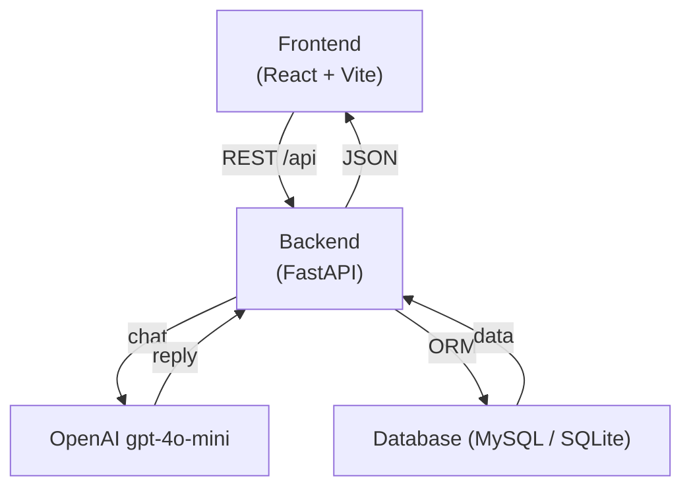

# 🎓 Studybuddy – AI Day Planner for Students


---

## 🧠 About the Project

**Studybuddy** is a full-stack web app that helps students plan their day through a conversation with an AI assistant.

Instead of filling forms, the student chats with **Buddy** — an OpenAI-powered agent that understands their week (lectures, deadlines, exams, group projects) and turns it into concrete calendar entries. The dashboard shows the resulting plan side-by-side with the chat, so you can iterate.

🌐 **Live version:** https://neeklines.xyz

🛠️ **Local setup:** see [Getting Started](#-getting-started) below.

---

## ✨ Features

### 🔐 Authentication
* Email + password registration & login
* Google OAuth
* JWT-based session, per-user data isolation

### 💬 AI Chat (Buddy)
* Powered by **OpenAI `gpt-4o-mini`**
* Multimodal — attach a screenshot of your syllabus or timetable and Buddy will read it
* Conversation history persisted per user and per session
* Client-side and server-side validation: JPEG/PNG/WebP, max 5MB

### 📅 Calendar
* Create, list, update and delete events
* Fields: title, description, start/end, type, priority, status
* Strict per-user scoping — you only see (and can touch) your own events

### 📱 Responsive UI
* React 19 + Vite + Bun, Tailwind v4
* Works on desktop and mobile

---

## 🏗️ Architecture



---

## 🛠️ Tech Stack

**Frontend**
* React 19
* Vite 7 + Bun
* Tailwind CSS v4
* React Router

**Backend**
* FastAPI (Python 3.11)
* SQLAlchemy 2
* OpenAI Python SDK (`gpt-4o-mini`)
* JWT (python-jose), Argon2 password hashing

**Database**
* MySQL (production)
* SQLite (development)

**Tooling**
* `pip-tools` for dependency pinning
* `black` + `flake8` for Python quality
* `pytest` for backend tests
* GitHub Actions for CI

---

## 📁 Project Structure

```plaintext id="str91x"
student-assistant/
├── frontend/                 # React + Vite + Bun
│   ├── src/
│   │   ├── components/       # UI primitives + ProtectedRoute
│   │   ├── context/          # AuthContext
│   │   ├── pages/            # Home, Dashboard
│   │   ├── services/         # authService, chatService, calendarService
│   │   └── main.jsx
│   ├── index.html
│   └── vite.config.js
│
├── backend/                  # FastAPI
│   ├── app/
│   │   ├── routers/          # auth, chat, calendar, health, meta
│   │   ├── models/           # User, ChatMessage, CalendarEvent
│   │   ├── schemas/          # Pydantic schemas
│   │   ├── services/         # auth_service, ai_agent
│   │   ├── dependencies/     # get_current_user
│   │   └── core/             # security (JWT)
│   ├── tests/
│   ├── requirements.in
│   ├── requirements.txt
│   └── .env.example
│
├── docs/
│   └── ROADMAP.md            # what's next
│
├── .github/workflows/        # CI
├── README.md
├── SCOPE.md
├── CONTRIBUTIONS.md
└── LICENSE
```

---

## 🚀 Getting Started

### 1️⃣ Clone Repository

```bash id="clone11"
git clone https://github.com/Neeklines/student-assistant
cd student-assistant
```

---

### 2️⃣ Backend Setup (FastAPI)

```bash id="backend22"
cd backend
python -m venv venv
source venv/bin/activate   # Windows: venv\Scripts\activate

pip install -r requirements.txt

cp .env.example .env       # then edit values, especially OPENAI_API_KEY
uvicorn app.main:app --reload
```

Backend runs at:

```id="backend-url"
http://localhost:8000
```

OpenAPI docs: `http://localhost:8000/docs`

---

### 3️⃣ Frontend Setup (React + Vite + Bun)

```bash id="frontend33"
cd frontend
bun install
bun run dev
```

Frontend runs at:

```id="frontend-url"
http://localhost:5173
```

The Vite dev server proxies `/api` → backend on port 8000 (see `vite.config.js`).

---

### ⚙️ Environment Configuration

Copy `backend/.env.example` to `backend/.env` and fill in the values. The most important one is:

```env id="env44"
OPENAI_API_KEY="sk-..."     # required for the chat to work
```

You can leave the database defaults — dev mode uses local SQLite (`./local.db`).

---

## 🧪 Running Tests

```bash id="test-cmd"
cd backend
pytest
```

CI runs `black --check`, `flake8` and `pytest` on every PR (see `.github/workflows/backend-ci.yml`).

---

## 🧠 Learning Goals

This project focuses on:

* Full-stack web development (React + FastAPI)
* Integrating an LLM into a real product (OpenAI tool/function design)
* Designing and securing REST APIs (per-user data scoping, JWT)
* Working with relational databases (MySQL, SQLite)
* Building clean, user-focused UI/UX
* Working as a team via GitHub PR workflow

---

## 👥 Team

* **Yehor Timofieiev** - Team lead
* **Ostap Lishchynskyi**
* **Alina Skyba**
* **Filip Furdyna** - Frontend dev
* **Bartosz Mroczek**
* **Jakub Fuhrman**
* **Sebastian Gęborys**

---

## 📄 Useful information

License: see [LICENSE](LICENSE).

To contribute, see [CONTRIBUTIONS.md](CONTRIBUTIONS.md).

Current scope is defined in [SCOPE.md](SCOPE.md). Upcoming work is tracked in [docs/ROADMAP.md](docs/ROADMAP.md).
